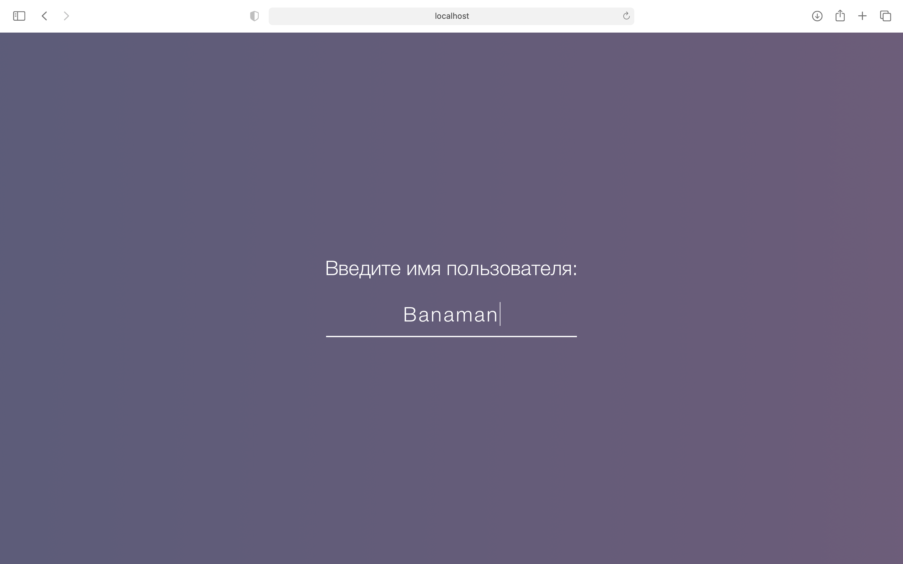
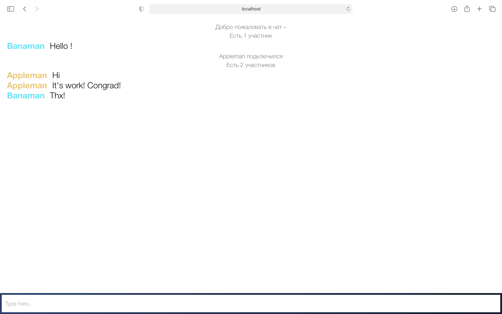

# Chat

Main idea: general and clear interface.

Node.js was used to implement the project. Node.js is a V8-based software platform that transforms JavaScript from a highly specialized language into a general-purpose language. It follows from this that the languages that were used to implement the application: HTML, CSS, JS.
Some open source libraries such as Socket.IO and jQuery have also been used. Socket.IO is a JavaScript library for web applications and real-time data exchange. jQuery is a set of JavaScript functions that focuses on the interaction of JavaScript and HTML.

Any modern browser will act as a client.

The application has two pages: login and chat lobby. Initially, the user goes to the authorization page, where he is asked to enter a name that will be assigned to him during the session. After successful input, the user enters the chat, the client sends a message to the server about the new client, the server sends to all other connected clients about this, and the client itself is given the color of the name, calculated from its hash. When a new user connects, a corresponding message appears in the chat and how many clients are currently in the chat. Everyone is in the same lobby, you cannot address something to a specific user, everyone sees messages in the chat

